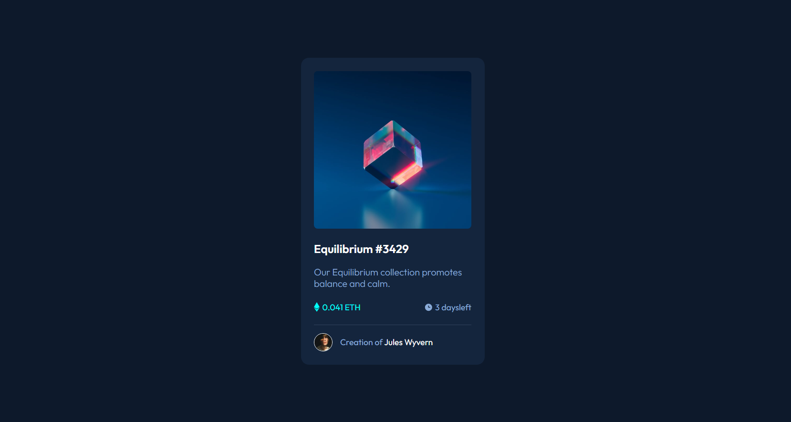

# Card NFT

Este é um projeto que fiz como parte do curso DevQuest, onde explorei a criação de um card NFT básico usando HTML e CSS para entender melhor a estilização e interatividade básica de elementos da web.

## Descrição

O projeto consiste em um simples card NFT, que inclui uma imagem e algumas informações básicas sobre o token não fungível. Este é um exercício introdutório para entender como estilizar elementos usando CSS e adicionar efeitos básicos de interação, como `:hover`, sem o uso de frameworks ou bibliotecas externas.

### Captura de Tela

## Como utilizar

1. Clone este repositório em sua máquina local.
2. Abra o arquivo `index.html` em seu navegador.
3. Interaja com o card NFT para ver os efeitos básicos implementados.

### Links

- URL do Site Ao Vivo: [cartao-nft](https://kevmartinsdev.github.io/cartao-nft/)